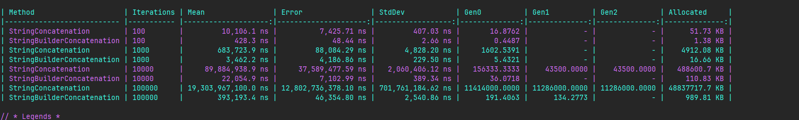

## Benchmark Results

### 1. Which approach was faster with 100 iterations?

StringBuilderConcatenation was faster because:
=>StringConcatenation: 10,106.1 ns
=>StringBuilderConcatenation: 428.3 ns
The StringBuilder approach took less time to execute

### 2. Which approach was faster with 100,000 iterations?

StringBuilderConcatenation was faster because:
=>StringConcatenation: 19,303,967,100 ns
=> StringBuilderConcatenation: 393,193.4 ns
The performance difference became much larger as the number of iterations increased

### 3. Which allocated more memory?

StringConcatenation allocated more memory than StringBuilderConcatenation because At 100,000 iterations:
=>StringConcatenation: 48,837,717.7 KB
=>StringBuilderConcatenation: 989.81 KB

This shows that repeated string concatenation creates much more memory allocations

### 4. What happened to string concatenation performance as loop size increased?

1-String concatenation became much slower as the number of iterations increased
2-The execution time increased significantly from 100 to 100,000 iterations

### 5. Why repeated string concatenation creates allocations?

Strings are immutable in C#. When using repeated concatenation a new string is created for each operation instead of modifying the existing string and This creates additional memory allocations

### 6. Why does StringBuilder usually perform better?

StringBuilder usually performs better because it can modify its existing buffer when appending text instead of creating a new string for every operation
and This reduces memory allocations and copying especially when many appends are performed

### 7. Is StringBuilder always better than normal string operations?
No StringBuilder is not always better
For simple string operations or a small number of concatenations=> normal string operations can be simpler
StringBuilder is more useful when many string modifications or appends are required